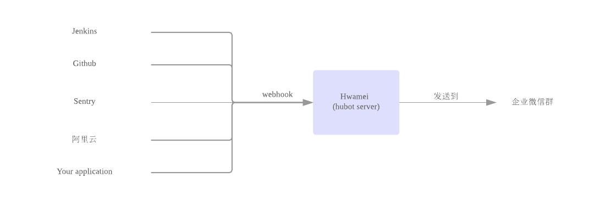

# hwamei

hwamei 是一个基于 hubot 的企业微信聊天机器人，它能够通过 webhook 将收集的信息发送到企业微信群中。

## 预览

## 工作流程

## 安装

- `git clone https://github.com/tlikai/hwamei.git`
- 运行 `npm install`
- 复制 sample.env 为 .env
- 到企业微信后台创建一个应用
- 将企业微信的 corpId 和 新建应用的 secret 填入 .env 文件

## 使用

- 运行 `./bin/hubot` 即可启动 hwamei

- 目前支持通过命令管理企业微信群、管理 webhook

## 部署

见 https://github.com/hubotio/hubot/blob/master/docs/deploying.md

## 企业微信相关命令

- `hwamei>wxwork create chat {chatid} with {users}` 创建一个群, users 以英文逗号分隔
- `hwamei>wxwork destroy chat {chatid}` 删除一个群
- `hwamei>wxwork show {chatid}` 显示群信息
- `hwamei>wxwork add {userid} to {chatid}` 添加用户到指定群
- `hwamei>wxwork remove {userid} from {chatid}` 从指定群中删除用户

企业微信消息推送文档 https://work.weixin.qq.com/api/doc#90000/90135/90243

## webhook 相关命令

- `hwamei>webhook create {name} from {type} to {chatid}` 创建一个 webhook
- `hwamei>webhook list` 列出所有 webhook
- `hwamei>webhook delete all` 删除所有 webhook
- `hwamei>webhook delete {token}` 删除一个 webhook
- `hwamei>webhook update {token} {name|type|chat_id} to {value}` 修改一个 webhook
- `hwamei>webhook backup` 备份 webhooks 到 ./data/webhooks.json
- `hwamei>webhook restore` 恢复 webhooks

### webhook 使用

1. 先创建 webhook
  - `hwamei>webhook create test_incoming_webhook from incoming to test`
  - 上面命令会创建一个名为 test_incoming_webhook 的 webhook，接收 incoming 类型的输入，输出到 test 企业微信群
  - 运行命令后系统会输出 webhook url，像这个 url 发送请求即可触发 webhook
  - `There is your webhook url: /incoming/408dcc98-60a6-4a10-8c77-4679dd9a0a40`
2. 测试 webhook
  - `shell>curl -XPOST http://localhost:8080/incoming/408dcc98-60a6-4a10-8c77-4679dd9a0a40 -H 'Content-type: application/json' -d '{ "message": "hello hwamei" }'`
  - 运行上面的命令，正常情况下你的企业微信群应该就收到消息了
3. 目前支持下列几种类型的 webhook type
  - incoming 
    - `{ "message": "hello hwamei" }`
    - `{ "text": "hello hwamei" }`
  - sentry
  - gitlab
  - github

## 扩展更多命令

查看 https://github.com/hubotio/hubot/blob/master/docs/scripting.md
